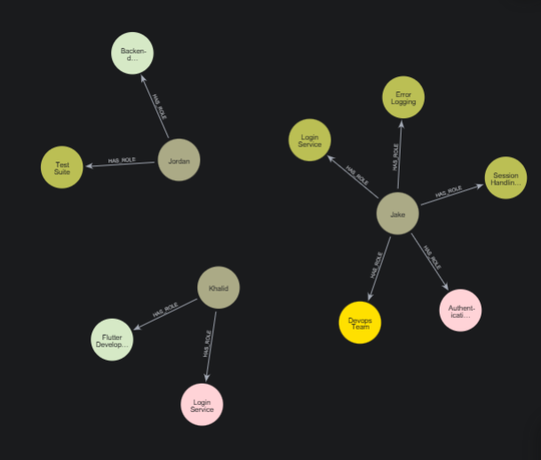
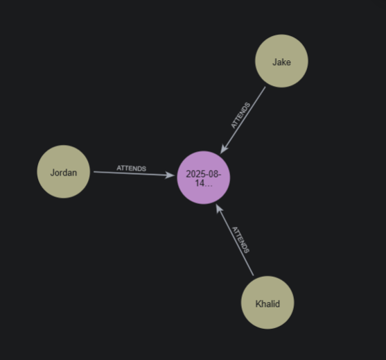

# Meeting Transcript Knowledge Graph Extractor

This project extracts structured knowledge from online meeting transcripts and stores it in a Neo4j knowledge graph. It leverages Large Language Models (LLMs) via `ChatOpenAI` to identify important entities, relationships, and personal information from meeting transcripts.

## Prerequisites

- Python 3.10+
- Neo4j database (cloud instance)
- OpenAI API key (or other supported LLM provider)

---

## Installation

1. Clone the repository:

```bash
git clone https://github.com/KhalidSinan/QbMS-Model.git
cd QbMS-Model/RAG
```

## Create a virtual environment and install dependencies:

```shell
python -m venv .venv
# Activate the environment
source .venv/bin/activate    # Linux/macOS
.venv\Scripts\activate       # Windows
# Install dependencies
pip install -r requirements.txt
```

## Install Neo4j Desktop or set up a cloud instance:

Go here [Neo4j Aura Cloud](https://neo4j.com/cloud/?utm_source=chatgpt.com) signup, create an instance and then save the credintials (password, username)for later.

## Configuration

Create a `.env` file in the project root with the following environment variables

```
# LLM configuration
OPENAI_API_KEY=your_openai_api_key
LLM_MODEL=gpt-4o-mini
LLM_TEMPERATURE=0.0

# Neo4j configuration
NEO4J_URI=neo4j+s://<instance-id>.databases.neo4j.io
NEO4J_USERNAME=neo4j
NEO4J_PASSWORD=<instance-password>
NEO4J_DATABASE=neo4j   # optional

# Transcript splitting
CHUNK_SIZE=400
CHUNK_OVERLAP=200
```

### Notes

- `NEO4J_URI` format for Aura Cloud: `neo4j+s://<instance-id>.databases.neo4j.io`
- Make sure your OpenAI API key has proper access for the LLM model you plan to use.

## Usage

1. Prepare a transcript in plain text, for example `example_transcript.txt`:

```python-repl
Meet in 2025-08-14 10:00PM
Attendees: Khalid, Jake, Jordan

[Khalid] Good afternoon everyone, let’s get started with our sprint planning.
...
```

2. Run the main script:

```shell
python grag.py
```


## Testing:

When query:

```sql
MATCH p=()-[:HAS_ROLE]->() RETURN p LIMIT 25;
```

Ouputs:



When query:

```sql
MATCH p=()-[:ATTENDS]->() RETURN p LIMIT 25;
```

Output:


